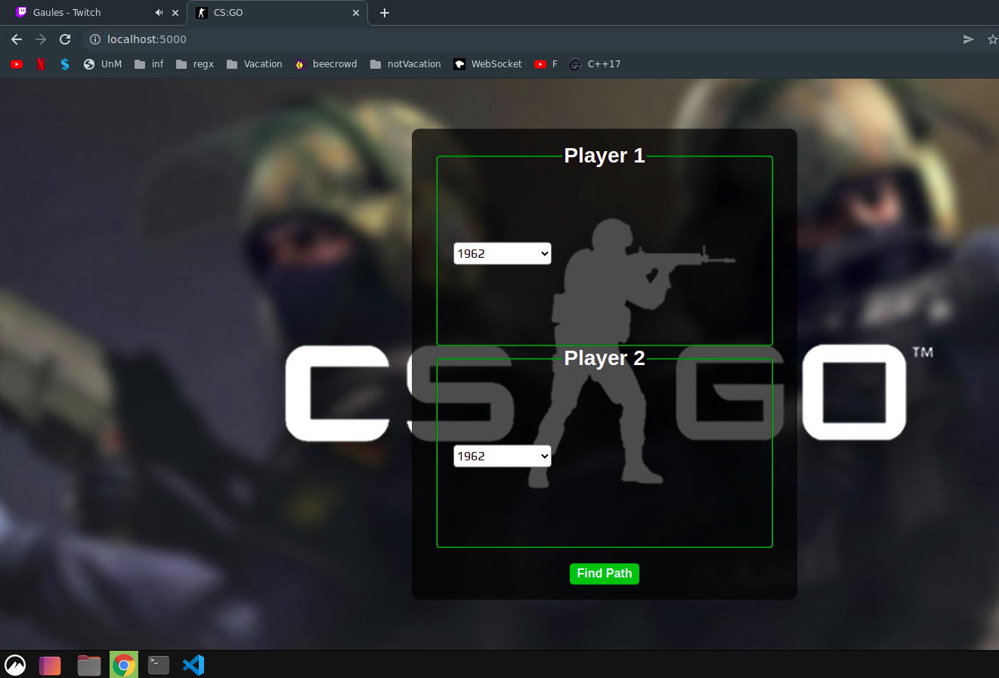
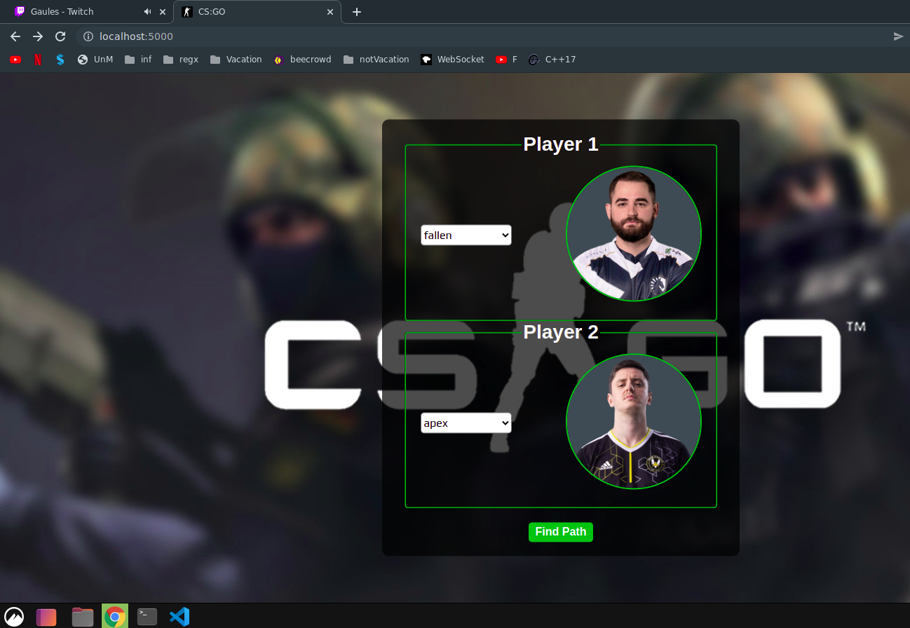
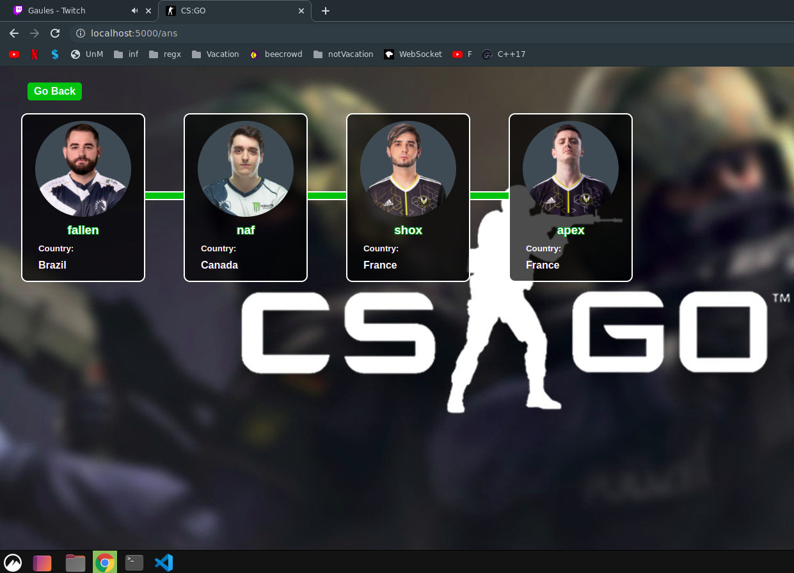

# CS:GO Connections

**Número da Lista**: NullPointerException<br>
**Conteúdo da Disciplina**: Grafos1<br>

## Alunos
|Matrícula | Aluno |
| -- | -- |
| 18/0033620  |  João Henrique C. Paulino |
| 18/0052845  |  Gabriela da Gama Pivetta |

## Sobre 


O projeto foi inspirado no conceito de [six degrees of separation](https://en.wikipedia.org/wiki/Six_degrees_of_separation#:~:text=Six%20degrees%20of%20separation%20is,as%20the%20six%20handshakes%20rule.), que curiosamente gerou o problema de [Kevin Bacon](https://blogs.ams.org/mathgradblog/2013/11/22/degrees-kevin-bacon/), que diz que todo ator de Hollywood tem alguma conexão com Kevin. Dado este ponto de partida, o programa tem como cerne saber qual a distância entre 2 jogadores de [CS:GO](https://store.steampowered.com/app/730/CounterStrike_Global_Offensive/?l=brazilian).

Para criar o grafo e suas conexões são levados em conta os seguintes fatores:
 - Os dados são obtidos pela [HLTV](https://www.hltv.org/stats/teams)
 - Se um player **X** já esteve presente na mesma lineup que **Y**, então a distância entre eles é 1.
 - A distância do player **X** até ele mesmo é 0.
 - O grafo pode não ser conexo.

## Screenshots




## Instalação 

**Linguagem**: Python3<br>
**Framework**: Flask<br>
 - Instalacao dos pacotes necessarios
```
  $ sudo apt install virtualenv
  $ virtualen env
  $ source env/bin/activate
  $ pip3 install -r requirements.txt

```
 - Execucao do projeto
```
  $ cd src
  $ python3 app.py
```

## Uso 
Acessar a pagina inicial da aplicacao( localhost:5000 ) usando o seu navegado de preferencia, em seguida selecionar 2 jogadores e clicar no botao para o processamento.

## Outros 
O projeto pode ser separado em 3 partes.

 1. Crawler para capturar os dados providos pela hltv.
 2. Arquivos de processamento interno( BFS, ESTRUTURA GRAFO/PLAYER)
 3. Flask APP para exibicao do projeto com o html/css/js.

Na primeira vez que o seu projeto for executado ele vai demorar um pouco mais do que o normal( mais ou menos uns 50 segundos ou 2 min dependendo da sua maquina e conexao com a internet), pois uma rotina no arquivo app.py esta sendo executada para gerar o arquivo storage.csv ( que seria a base de dados do projeto).

Lembre-se para execucao correta do projeto esteja dentro da pasta src e em seguida execute app.py. A instalacao dos requirements.txt e fundamental.

link para o video de apresentacao: [CS:GO](https://drive.google.com/file/d/1R-D8vtyrTmbZz3paKJEzj_qxui2K6dxv/view)
